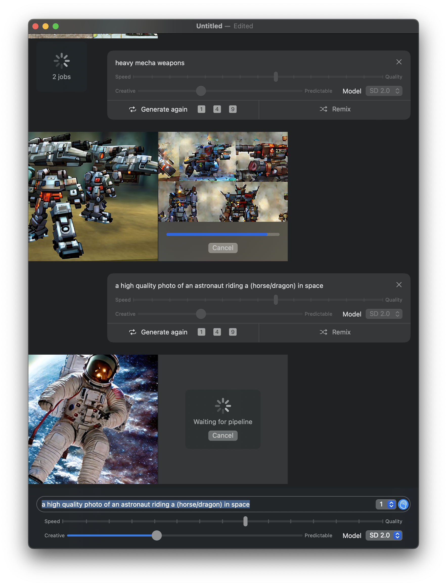

# Gauss

A Stable Diffusion app for macOS built with SwiftUI and Apple's [ml-stable-diffusion](https://github.com/apple/ml-stable-diffusion) CoreML models.

## Building from source

1. Clone this repo
1. Clone my fork of [ml-stable-diffusion](https://github.com/justjake/ml-stable-diffusion) into the repo.
1. Follow the instructions to set up the ml-stable-diffusion python library.
1. Run `./build-models.sh ./build`. You may need to adjust the Conda setup goo in the script.
1. Edit Gauss/GaussKernel.swift and update `GaussKernelResources.sourceCodeRoot` to point to the directory where you cloned this repo.
1. Open project in Xcode and click build!

## Usage

- Write prompt text and adjust parameters in the composer view at the bottom.
- To export an image, just drag it to Finder or any other image editor.
- You can always generate more images from an existing prompt.
